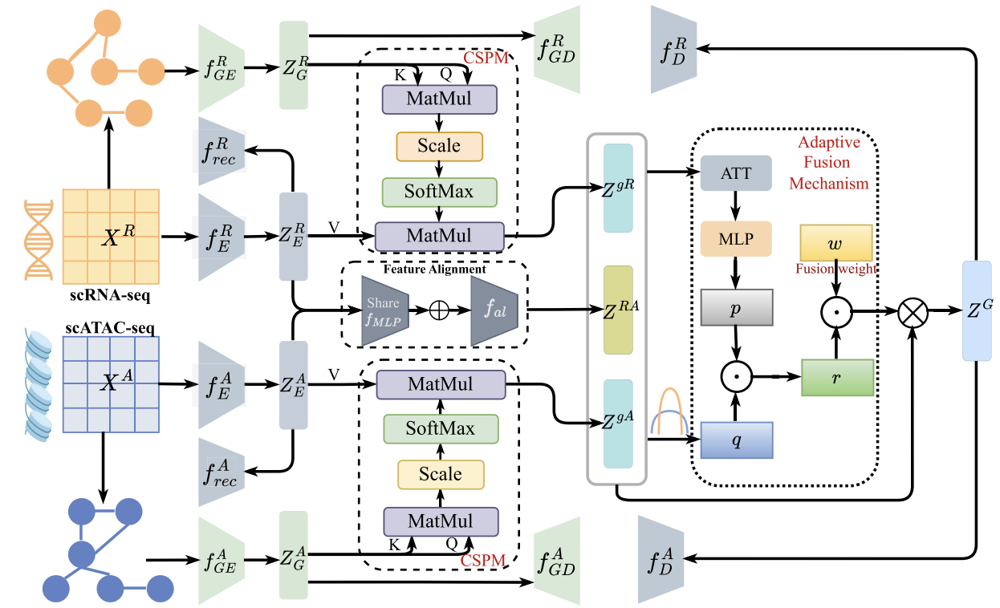

# <p align=center> scSPAF: Cell Similarity Purified  Adaptive Fusion Network for Single-Cell Multi-Omics Clustering </p>

>**Authors:**
Shanghui Deng, Xiao Zheng, Chang Tang, Xinwang Liu, Yuanyuan Liu, Shan An

### 1. Overview
<p align="center">
   <br/>
</p>

### 2. Datasets
Ma-2020, PBMC-3k, PBMC-10k, BMNC, GSE, and GSE100866 datasets can be downloaded from [Google Drive](https://drive.google.com/drive/folders/17Q1rlOfqSKdVlIXqqs8oBC6BIpqaEt-o?usp=sharing).

### 3. Pretrained Model 
The Pretrained Model can be downloaded from [Google Drive](https://drive.google.com/drive/folders/17Q1rlOfqSKdVlIXqqs8oBC6BIpqaEt-o?usp=sharing). It can also be obtained through code training.

### 4. Requirement
- Pytorch --- 2.4.0
- Python --- 3.9.19
- Numpy --- 1.26.4
- Scipy --- 1.13.1
- Sklearn --- 1.5.2
- Munkres --- 1.1.4
- tqdm --- 4.66.5


### 5. Usage

#### Clone this pro
```
git clone https://github.com/Shanghui-Deng/scSPAF_TCBB2025.git
```
#### Code structure
- ```data_loader.py```: loads the dataset and contruct the cell graph
- ```opt.py```: defines parameters
- ```utils.py```: defines the utility functions
- ```encoder.py```: defines the AE and GAE
- ```scSPAF.py```: defines the architecture of the whole model
- ```main.py```: run the model

#### Example command
Take the dataset "PBMC-3k" as an example

- Step 1: Pre-training model
```
python main.py --name PBMC-3k --pretrain True
```
- Step 2: Formal training model with pre-training model
```
python main.py --name PBMC-3k
```

### 6. Citation
Please cite our paper if you find the work useful:
```
@ARTICLE{deng2025scspaf,
  author={Deng, Shanghui and Zheng, Xiao and Tang, Chang and Liu, Xinwang and Liu, Yuanyuan and An, Shan},
  journal={IEEE Transactions on Computational Biology and Bioinformatics}, 
  title={scSPAF: Cell Similarity Purified Adaptive Fusion Network for Single-Cell Multi-Omics Clustering}, 
  year={2025},
  volume={22},
  number={6},
  pages={2943-2954},
  doi={10.1109/TCBBIO.2025.3608251}}

```
